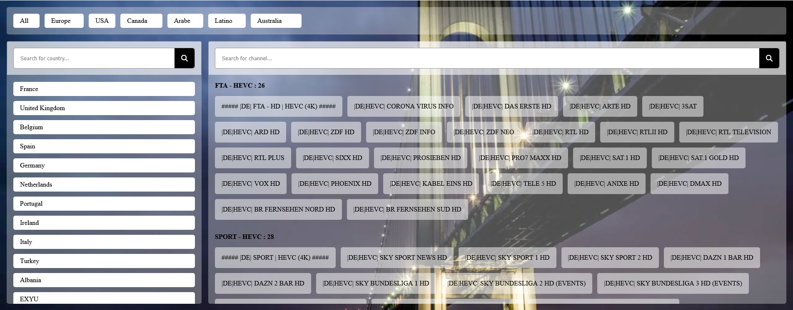

# Vue Country and Channel Selector



## Introduction

The Vue Country and Channel Selector is a JavaScript application that provides a user interface for selecting continents, countries, and channels. It leverages Vue.js for reactive components and Font Awesome for icons. The application dynamically fetches and displays channels based on the user's selection of continent and country.

## Table of Contents

- [Vue Country and Channel Selector](#vue-country-and-channel-selector)
  - [Introduction](#introduction)
  - [Table of Contents](#table-of-contents)
  - [Requirements](#requirements)
  - [Initialization](#initialization)
  - [Event Handling](#event-handling)
  - [Vue Components](#vue-components)
    - [Continent Component](#continent-component)
    - [Vue Instance](#vue-instance)
  - [Styles](#styles)
  - [External Dependencies](#external-dependencies)
  - [Usage](#usage)
  - [Conclusion](#conclusion)

## Requirements

- The application requires the Vue.js library (version 2) for reactive components.
- Font Awesome (version 6.5.1) is used for icons.
- The application assumes the existence of a server that provides JSON data for channels.

## Initialization

The `init` function initializes the application by adding necessary styles, external scripts (Vue.js and Font Awesome), and event listeners.

```javascript
function init() {
  // ... (See the original code for style, link, and script additions)
  window.addEventListener("scroll", handleScroll);
}
```

## Event Handling

The `handleScroll` function is called when the user scrolls. It initializes a Vue component (`continent-component`) and a Vue instance (`app`) for handling the continent, country, and channel selection.

```javascript
function handleScroll() {
  // ... (See the original code for Vue component and instance creation)
  window.removeEventListener("scroll", handleScroll);
}
```

## Vue Components

### Continent Component

The `continent-component` Vue component provides a user interface for selecting continents, countries, and channels. It includes methods for updating the selected continent, selected country, and fetching channels for the selected country.

### Vue Instance

The Vue instance (`app`) is created to mount the `continent-component` and pass initial data (continents and countries) as props.

## Styles

The styles for the application are embedded within the `style` variable in the `init` function. The styles define the layout, appearance, and behavior of the UI elements, including continent and country lists, search bars, and channel categories.

## External Dependencies

- Vue.js (version 2): A JavaScript framework for building user interfaces.
- Font Awesome (version 6.5.1): A font and icon toolkit.

## Usage

1. Include the `channels.js` script in your HTML file.
2. Add a `div` with `app` id to your HTML file.

## Conclusion

The Vue Country and Channel Selector offers a simple and dynamic way for users to explore channels based on their geographic preferences. It demonstrates the use of Vue.js for building interactive components and Font Awesome for enhancing the user interface. The application can be customized and extended to support additional features and data sources.